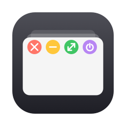

<p align="center">
  
</p>

<h1 align="center">ExtraMissionControls</h1>

<p align="center">
  Close buttons for macOS Mission Control <br></br>
  close any window or fullscreen space right from the overview.
</p>

<p align="center">
  <a href="https://buymeacoffee.com/eastwoodsee">
    
  </a>
</p>

---

Apple never shipped a close button in Mission Control. This menu-bar app adds
a whole row of them: open Mission Control the way you always do (swipe up / ⌃↑
/ F3) and every window thumbnail gains **macOS-style controls in its top-left
corner** — close, minimize, full screen, and quit — with hover highlighting.
Fullscreen apps in the Spaces Bar get their own close and exit-full-screen
buttons. Click one and it applies as you leave Mission Control, so the
overview never breaks.

## Features

- **Four controls on every window thumbnail**, laid out like the macOS traffic
  lights in the top-left corner:
  - **✕ close** (red)
  - **− minimize** (yellow) — to the Dock
  - **⤢ full screen** (green)
  - **⏻ quit** (purple) — quits the whole app with ⌘Q, so it can still prompt
    to save unsaved work
- Close, minimize, and quit are **deferred until you leave Mission Control**:
  the thumbnail dims with the pending symbol so you can see what's queued, and
  nothing is left behind as a dead "ghost" thumbnail
- **Fullscreen apps in the Spaces Bar (top section)** get a **✕** that drops
  the app back to the desktop and closes it as you leave, plus a **❏** that
  only exits full screen — the app becomes a normal window and Mission Control
  stays open
- Split View tiles get a single **✕2** button that closes both apps of the
  split (closing just one half is not reliably possible on macOS)
- Works even on apps with **broken accessibility** (e.g. Steam): close and
  minimize fall back to a synthetic click on the real traffic-light button,
  and full screen uses the window's own full-screen button
- Hover highlighting in the matching traffic-light color
- Buttons track Mission Control's layout live (thumbnail re-flow, Spaces Bar
  expanding/shrinking) and scale down on small tiles
- Just a menu-bar item — no Dock icon, no windows of its own
- Near-zero idle cost: one cheap WindowServer query 4×/s (with timer
  tolerance so macOS coalesces wake-ups) that **stops entirely while the
  display is asleep**; window references refresh only on real events (launch,
  space switches, app activations) instead of polling, so no other app is ever
  woken while you're not using Mission Control

## How it works

Mission Control is rendered by the system `Dock` process and cannot be
modified directly, but the Dock publishes the thumbnail layout through the
Accessibility API (an `AXGroup` with identifier `mc` appears in its AX tree
while Mission Control is active, with one `AXButton` per thumbnail exposing
title/position/size). This app:

1. polls the Dock's AX tree to detect Mission Control opening, then re-syncs
   button positions at 10 Hz so they track thumbnails re-flowing and the
   Spaces Bar expanding/shrinking (✕ buttons scale down on small tiles),
2. floats a tiny always-on-top ✕ panel over each window thumbnail and each
   fullscreen app's Spaces Bar tile (never plain "Desktop N" tiles),
3. intercepts clicks on those rects with a `CGEventTap` (while Mission Control
   is up, WindowServer routes mouse events to the Dock even though our panels
   render on top — the tap claims clicks on our buttons before the Dock sees
   them, and only those clicks), and
4. queues the action and applies it the instant Mission Control closes.
   Closing, minimizing, or quitting a window *in place* while the overview is
   still open leaves a dead "ghost" thumbnail the Dock keeps for the rest of
   the session (clicking it would reopen the app), so instead the thumbnail
   dims with the pending symbol and the real action — pressing the window's
   close/minimize button, or asking its app to quit (⌘Q) — runs as you leave.

Fullscreen apps take a different route. Closing one from the Spaces Bar first
drops it back to the desktop in place (`AXRemoveDesktop` — you stay in Mission
Control), where it reappears as an ordinary window thumbnail with the dim ✕
scrim; the app's window is then closed by name as you leave, exactly like a
desktop close. The **❏** button uses the same `AXRemoveDesktop` step but stops
there, leaving the app windowed. (An accumulative registry of fullscreen
windows — scanned while Mission Control is closed, refreshed on every space
switch — keeps AX references pressable from any space for the fallback paths.)

Apps with a hollow accessibility tree (Steam) expose no close/minimize button
at all. For those, the deferred action falls back to a synthetic click on the
real traffic-light button once Mission Control is gone — it raises the window
and clicks the button at the window's top-left corner. Full screen likewise
falls back from the window's own AX full-screen button to a click on the green
button.

## Install

Requires macOS 13 or later (developed and tested on macOS 26).

### 1. Download

Grab the latest `ExtraMissionControls-<version>.dmg` from the
**[Releases page](../../releases)**.

### 2. Install

Open the DMG and drag **ExtraMissionControls** into the **Applications**
folder.

### 3. First launch (unsigned-app hoop, one time only)

This is a free, open-source app and is **not notarized by Apple** (that
requires a paid Apple Developer subscription), so macOS blocks the very first
launch. Getting past it is a one-time step:

**macOS 15 Sequoia and later** (the right-click trick no longer works):

1. Double-click the app once — macOS shows *"Apple could not verify…"* /
   *"was not opened"*. Click **Done**.
2. Open **System Settings → Privacy & Security**, scroll to the bottom — you
   will see *"ExtraMissionControls" was blocked…* Click **Open Anyway**.
3. Confirm **Open Anyway** in the dialog (authenticate if asked).

**macOS 13–14:** right-click (Control-click) the app in Applications →
**Open** → **Open**.

Every later launch opens normally.

### 4. Grant permissions

The app prompts for both on first launch; grant them in
**System Settings → Privacy & Security**:

| Permission | Why the app needs it | Without it |
|---|---|---|
| **Accessibility** | Detecting Mission Control, receiving ✕ clicks, pressing windows' close buttons | Nothing works |
| **Screen Recording** | Window *titles* only (matches thumbnails to windows in fallback close paths) — nothing is recorded | Apps with broken accessibility (e.g. Steam) can't be closed |

Then **quit and relaunch the app** (menu-bar icon → Quit) — macOS applies
permissions only to newly launched processes.

That's it: the grid icon sits in your menu bar; open Mission Control and
every window gets its row of controls.

**Updating:** just replace the app with the one from a newer DMG — builds are
signed with a stable identity, so your permissions carry over.

## Development

### From source

```sh
git clone https://github.com/seastwood/ExtraMissionControls.git
cd ExtraMissionControls
python3 -m venv .venv
.venv/bin/pip install -r requirements.txt
.venv/bin/python main.py
```

Python 3.9+ with [PyObjC](https://pyobjc.readthedocs.io/) (installed by
`requirements.txt`).

### Running from PyCharm

1. Open this folder as a project.
2. **Settings → Project → Python Interpreter → Add Interpreter → Existing**,
   pick `.venv/bin/python`.
3. Run `main.py`.

When running from source, the permissions above must be granted to
**whichever app launches the Python process** (PyCharm or your terminal),
and that app must be fully restarted after granting.

## Building the DMG

```sh
./scripts/build_dmg.sh
```

Runs py2app and produces `dist/ExtraMissionControls-<version>.dmg` with a
drag-to-Applications layout, app icon, and volume icon. The icon itself is
generated by `scripts/make_icon.py` (vector-drawn PyObjC, no image assets).

## Permissions that survive updates (code signing)

macOS ties granted permissions to an app's **code-signing identity**, not its
name or location. An unsigned / ad-hoc app's identity is a hash of its binary,
which changes on every build — so each update looks like a brand-new app and
Accessibility / Screen Recording get **reset**.

To fix this, every build is signed with a **stable** identity, so the signing
requirement (`identifier + certificate leaf`) is identical across rebuilds and
permissions persist. `build_dmg.sh` picks, in order:

1. `$EMC_SIGN_IDENTITY` if set;
2. a **Developer ID Application** certificate if you have one (best — also
   passes Gatekeeper when notarized);
3. otherwise a **self-signed** identity it creates on first build via
   `scripts/setup_signing.sh`.

The self-signed identity is generated once and backed up to
`~/.config/extramissioncontrols/emc-signing.p12` so the *same* identity is
reused even if the keychain or repo is deleted (**keep this file** — losing it
resets everyone's permissions on the next update). It lives in a dedicated
`emc-signing` keychain; nothing sensitive is stored.

**First install of the signed app:** because the identity changed from the old
ad-hoc build, grant the permissions once more (and remove any stale
ExtraMissionControls entries in System Settings → Privacy & Security first).
Every update after that keeps them.

**Gatekeeper:** a self-signed app isn't notarized, so macOS blocks the first
launch — see [First launch](#3-first-launch-unsigned-app-hoop-one-time-only)
above for the one-time steps. Distribution without that hoop would require a
paid Developer ID certificate and notarization.

## Testing

Automated end-to-end tests (they briefly take over screen and mouse: opening
Mission Control, clicking ✕ buttons with synthetic events, verifying windows
really closed):

```sh
.venv/bin/python scripts/test_mc_e2e.py                    # Finder victim
EMC_VICTIM=textedit .venv/bin/python scripts/test_mc_e2e.py # held-ref path
.venv/bin/python scripts/test_mc_fullscreen_e2e.py          # Spaces Bar tile
```

Env hooks: `EMC_DEBUG=1` (log close paths), `EMC_NO_REGISTRY=1` /
`EMC_FORCE_UNFS=1` (force the fallback paths under test).

## Project layout

| File | Purpose |
|---|---|
| `main.py` | Entry point (run this in PyCharm) |
| `extra_mission_controls/app.py` | Menu-bar shell, permission prompts |
| `extra_mission_controls/mission_control.py` | ✕ buttons over Mission Control (AX polling + event tap + close chains) |
| `extra_mission_controls/windows.py` | Window enumeration (CG window list) |
| `extra_mission_controls/ax.py` | Dock AX tree reading; window close primitives |
| `extra_mission_controls/ui.py` | Shared ✕ button styling |
| `scripts/make_icon.py` | Generates the app/volume icon |
| `scripts/setup_signing.sh` | Creates the stable self-signed signing identity |
| `scripts/probe_dock_ax.py` | Dev tool: dump the Dock's AX tree with Mission Control open |
| `scripts/test_mc_e2e.py` | E2E test: window thumbnails |
| `scripts/test_mc_fullscreen_e2e.py` | E2E test: Spaces Bar fullscreen tiles |
| `setup.py`, `scripts/build_dmg.sh` | py2app + DMG packaging |

## Known limitations

- The Dock's Mission Control AX layout (`mc` / `mc.display` / `mc.windows`
  identifiers) is undocumented and can change between macOS releases — this is
  the fragile part of the technique, verified working on macOS 26.
- Windows are matched to thumbnails by title; two windows with identical
  titles in the same app may close the wrong twin.
- Buttons appear on the current display only (multi-monitor support TODO).
- Fullscreen windows the app has never had AX sight of (fullscreened before
  the app launched, space never visited since) close via a fallback that
  briefly leaves Mission Control and returns.

## Support

If this scratches an itch Apple wouldn't:
**[buy me a coffee ☕](https://buymeacoffee.com/eastwoodsee)**
